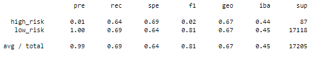
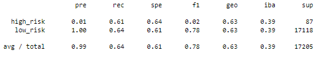
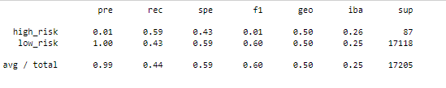
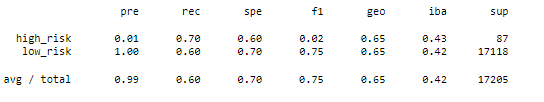
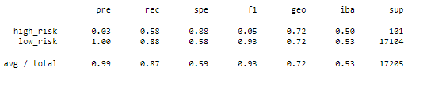
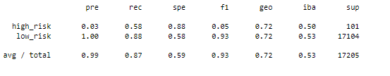

# Credit_Risk_Analysis
## Overview
This week's challenge was focused on evaluating credit card risk using supervised machine learning.  We were instructed to use both oversampling and undersampling techniques, including RandomOverSampler, SMOTE, and Cluster Centroids.  We also used a combination of the two with SMOTEEN.  Our last two models, BalancedRandomForestClassifier and EasyEnsembleClassifier, reduced bias.  

Overall the goal was for me to determine which model worked best for the provided dataset. After running all of the models, I received the results below.  

## Results 
### Oversampling 
#### Naive Random Oversampling
|   | Predicted False | Predicted True |
| ------------- | ------------- |------------- |
| Actually False | 56 | 31 |
| Actually True | 5329 | 11789 |

* Accuracy: 66%
* Precision: 99%
* Recall: 69%

#### SMOTE Oversampling  
|  | Predicted False | Predicted True |
| ------------- | ------------- |------------- |
| Actually False | 53 | 34 |
| Actually True | 6129 | 10989 |

* Accuracy: 62%
* Precision: 99%
* Recall: 64% 

### Undersampling - Cluster Centroids 
|   | Predicted False | Predicted True |
| ------------- | ------------- |------------- |
| Actually False | 51 | 36 |
| Actually True | 9683 | 7495 |

* Accuracy: 51%
* Precision: 99%
* Recall: 44% 

### Combination (Over and Under) Sampling - SMOTEENN 
|   | Predicted False | Predicted True |
| ------------- | ------------- |------------- |
| Actually False | 61 | 26 |
| Actually True | 6802 | 10316 |

* Accuracy: 65%
* Precision: 99%
* Recall: 60% 

### Ensemble Learners
#### Balanced Random Forest Classifier 
|   | Predicted False | Predicted True |
| ------------- | ------------- |------------- |
| Actually False | 59 | 42 |
| Actually True | 2135 | 14696 |

* Accuracy: 72%
* Precision: 99%
* Recall: 87% 

#### Easy Ensemble AdaBoost Classifier 
|   | Predicted False | Predicted True |
| ------------- | ------------- |------------- |
| Actually False | 93 | 8 |
| Actually True | 983 | 16121 |

* Accuracy: 93%
* Precision: 99%
* Recall: 87% 

## Summary  
Between the models, all of them had a 99% accuracy rating.  The ensemble learning methods were above any of the over/under/combosampling on both accuracy and recall.  The best model for this dataset was definitely the EasyEnsembleClassifier, as it had the highest overall cobmination of accuracy and precision of all of the models, and best fits the credit risk dataset provided.  